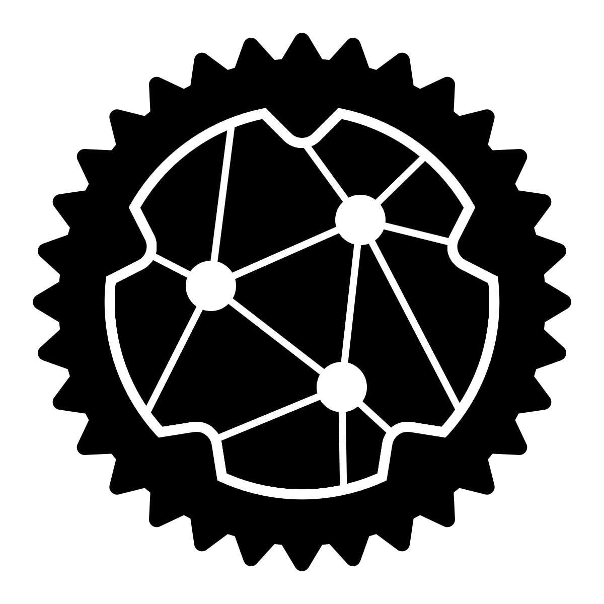
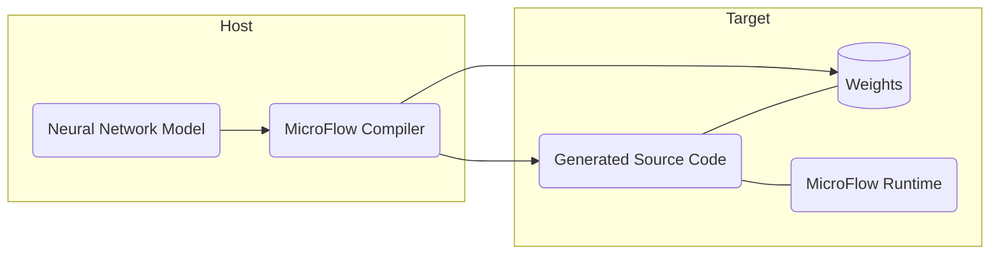

<p align="center">
  
</p>

<h1 align="center">MicroFlow</h1>
<h3 align="center">A robust and efficient TinyML inference engine</h3>
<p align="center">
  <a href="https://crates.io/crates/microflow"></a>
  <a href="https://docs.rs/microflow"></a>
  <a href="https://github.com/matteocarnelos/microflow-rs/actions/workflows/cargo.yml"></a>
</p>

<br>

MicroFlow is a robust and efficient TinyML inference engine designed for deploying machine learning models on embedded systems.
It was developed by Matteo Carnelos as part of his master's thesis project at the [University of Padova](https://www.unipd.it/en/) in collaboration with [Grepit AB](https://github.com/GrepitAB).

MicroFlow uses a compiler-based approach, resulting in the following engine structure:



MicroFlow consists of two primary components: the compiler, represented by the `microflow-macros` crate, and the runtime, represented by the `microflow` crate.
The compiler, which runs prior to the Rust compiler, is responsible for parsing and pre-processing the model.
It generates the necessary source code to enable inference on the model.
On the other hand, the runtime is a `[no_std]` component designed to run on the target MCU.
It encompasses the implementation of operators, activation functions, and quantization procedures.

## Usage

MicroFlow utilizes Rust [Procedural Macros](https://doc.rust-lang.org/reference/procedural-macros.html) as its user interface.
By applying the `model` macro to a `struct` and providing the model's path, the MicroFlow compiler generates a `predict()` method.
This method can be called to perform inference on the given model.
Currently, MicroFlow only supports models in the TensorFlow Lite format (`.tflite`).

Here is a minimal example showcasing the usage of MicroFlow:

```rust ignore
use microflow::model;

#[model("path/to/model.tflite")]
struct MyModel;

fn main() {
    let prediction = MyModel::predict(input_data);
}
```

## Examples

The examples provided with MicroFlow can be found in the `examples` folder.
To run an example on a target board, `cd` into the board directory for the example (e.g. `examples/arduino-uno`) and run the command:
```bash ignore
cargo run --example <example-name>
```
Otherwise, to run the example locally, just run the above command in the root directory.

> [!NOTE]
> For board examples, you might need to install additional tools and configure the runner to make the example work for your setup.

## Supported Operators

Currently, MicroFlow supports the following operators and activation functions:

| Operator          | Quantized | Tensor Type            |
|-------------------|-----------|------------------------|
| `FullyConnected`  | &check;   | `Tensor2D`             |
| `Conv2D`          | &check;   | `Tensor4D`             |
| `DepthwiseConv2D` | &check;   | `Tensor4D`             |
| `AveragePool2D`   | &check;   | `Tensor4D`             |
| `Reshape`         | &check;   | `Tensor2D`, `Tensor4D` |

| Activation Function | Quantized |
|---------------------|-----------|
| `ReLU`              | &check;   |
| `ReLU6`             | &check;   |
| `Softmax`           | &check;   |

These operators and activation functions cover common building blocks for neural networks and enable efficient inference with reduced memory and computational requirements.
However, MicroFlow's development roadmap includes plans for implementing additional operators and activation functions to expand the range of supported models.

## Tested Models and MCUs

The `examples` folder contains the code used to test MicroFlow on different MCUs, including:

- ESP32 (32-bit Xtensa)
- ATSAMV71 (32-bit Cortex-M7F)
- nRF52840 (32-bit Cortex-M4F)
- LM3S6965 (32-bit Cortex-M3)
- ATmega328 (8-bit AVR)

The models ued to test the inference engines can be found in the `models` directory.
These models include:

- A sine predictor
- A speech command recognizer (TinyConv)
- A person detector (MobileNet v1)

## Contributing

Contributors are welcome.
For major changes, please open an issue first to discuss what you would like to change.
Please make sure to update tests as appropriate.

## License

Licensed under either of

* Apache License, Version 2.0 ([LICENSE-APACHE](LICENSE-APACHE) or <http://www.apache.org/licenses/LICENSE-2.0>)
* MIT license ([LICENSE-MIT](LICENSE-MIT) or <http://opensource.org/licenses/MIT>)

at your option.

Copyright © 2024, [Matteo Carnelos](https://github.com/matteocarnelos)
