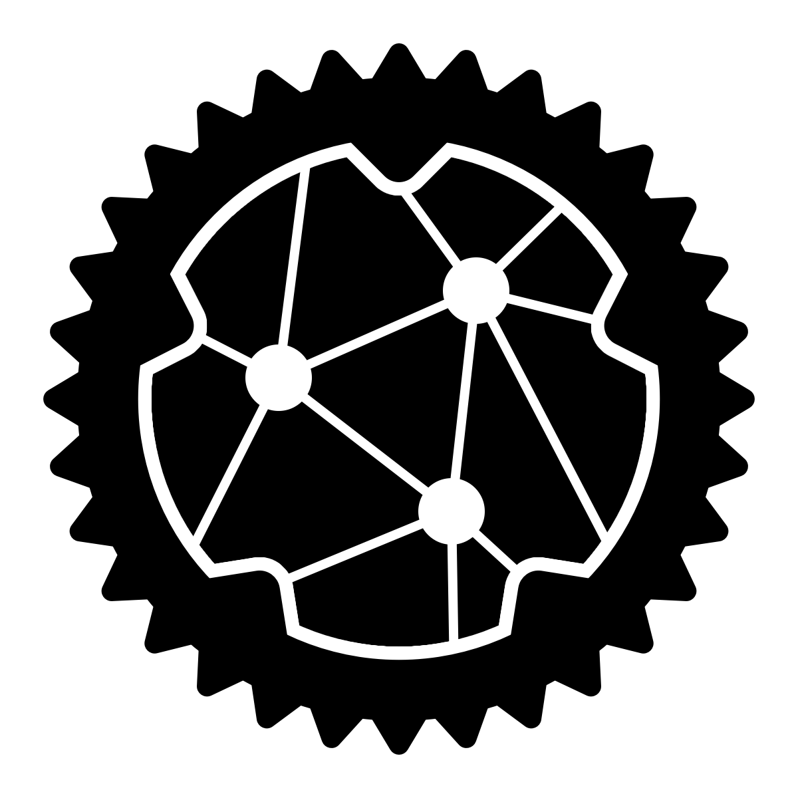
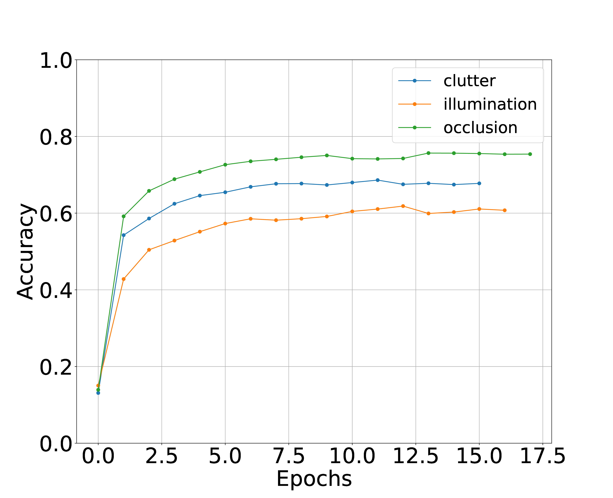
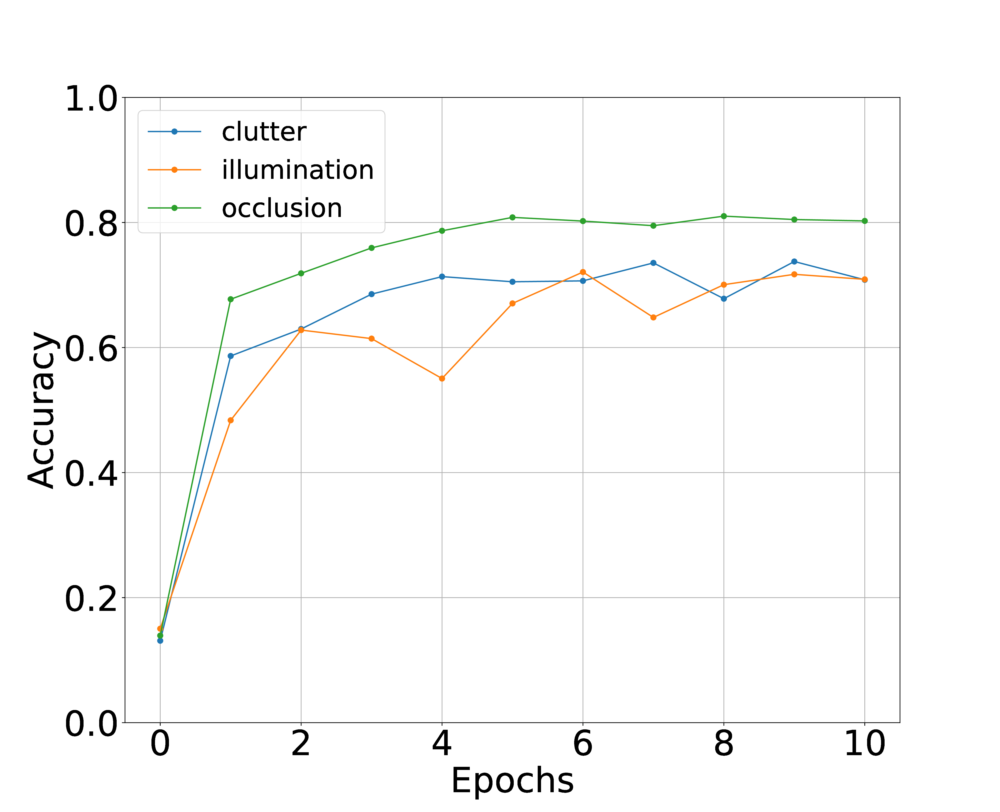
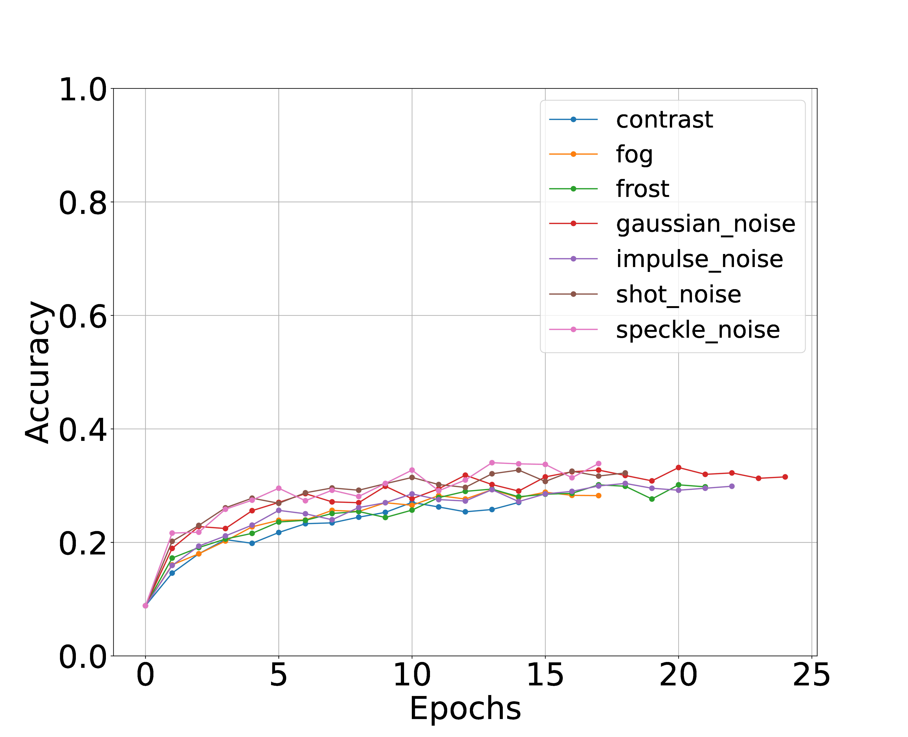
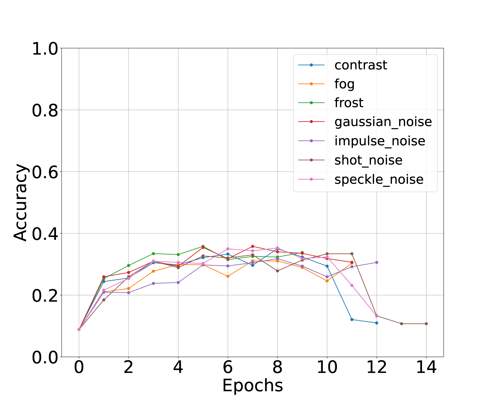

<p align="center">
  
</p>

<h1 align="center">MicroFlow-ODT</h1>
<h3 align="center">An efficient TinyML finetuning engine</h3>


<br>
This repository contains the On Device Training (ODT) extension to [MicroFlow](https://github.com/matteocarnelos/microflow-rs) by Giovanni Artico as part of their master's thesis project at the [University of Padova](https://www.unipd.it/en/) in collaboration with [IAS-Lab](https://iaslab.dei.unipd.it/groups/mig/about/).
The Microflow inference engine was originally developed by Matteo Carnelos as part of his master's thesis project at the [University of Padova](https://www.unipd.it/en/) in collaboration with [Grepit AB](https://github.com/GrepitAB).

MicroFlow-ODT has the following pipeline, based on MicroFlow inference:


MicroFlow-ODT does not change the original code other than few minor adjustments, and mainly adds `microflow-odt-macros` crate (containing the macros for the trainable networks and gradient functions.

## Microflow-ODT demo

The method was tested on a simple robot equipped with an ESP32-CAM, by finetuning a generic CNN on data recorded directly on the device,
achieving 75% final accuracy on the test, a 25% improvement over the original model. The video of the demo is shown below:

[](https://youtu.be/xp5rjwH7eYw)

## Usage

MicroFlow utilizes Rust [Procedural Macros](https://doc.rust-lang.org/reference/procedural-macros.html) as its user interface.
The usage is analogous is similar to the original MicroFlow, with the addition of necessary parameters for training.

Here is a minimal example showcasing the usage of MicroFlow-ODT:

```
#### Microflow ODT 
```rust ignore
use microflow_odt_macros::model;

/*additional arguments:
  number of layers to train
  loss
  skip the last layer
  backward gradient norms
  weights gradient norms
*/
#[model("path/to/model.tflite", 5, "crossentropy", true, [30000.0,30000.0,0.0], [16000.0,4096.0,1024.0])]
struct MyModel;

fn main() {
    let model = MyModel::new()
    for i in 0..batch_size{
      let prediction = MyModel::predict_train(input_data, label, learning rate);
    }
    model.update_layers(batch, learning_rate);
}
```

## MicroFlow-ODT usage

The system designed needs some additional work compared to a plug-and-play framework like tensorflow.
- The gradient accumulation is automatically done when `predict_train` is called, however after each batch (of arbitrary size)
the `update_layers` has to be called with the batch size used to actually update the layers.
1. First the model should be first tested in training with incrementally more layers.
2. At each layer the norm of the gradient of the backpropagation and the one for the weight update should be picked.
3. As overflows can happen if this isn't the chosen norms are too high, first a run in debug mode on a few batches should be done,then one in release mode to properly assess the performance achieved with the chosen parameters and gather information on the percentage of satuated parameters and parameters that have actually been updated. 
4. This should be done at each layer, as the addition of new ones should not interfere with the later ones.

### Results using MicroFlow-ODT
### CIFAR10-C and OpenLoris-Object Training Results

|| 1 Layer | 2 Layers |
|-------|-------|-------|
|OpenLoris-Object|  |  |
|Cifar10-C|  |  |

## Examples

Otherwise, to run the example locally, just run the above command in the root directory.
For a full example of training on a board, have a look at [the ESP32CAM example](https://github.com/Geostartico/esp32_microflow_train), 
which was designed to run on a SunFounder Galaxy RVR but can be adapted to other tasks

> [!NOTE]
> The datasets must be unzipped, Not all the datasets rquired to run the examples are present for size support

## Supported Operators

The same operations supported in MicroFlow are supported in MicroFlow-ODT other than trainable intermediate Softmax activations

## Tested Models

The models ued to test the training engines can be found in the `models/train` directory.
These models include:

- LeNet
- MobileNetv1
- Sine predictor
- Speech recognizer

## Citation

TBA

